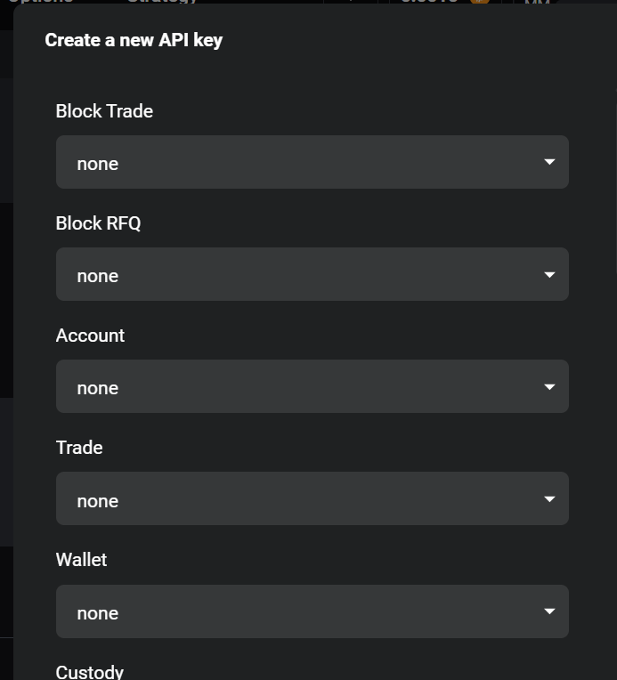

# API Key Setup

Here's a detailed guide on how to get your API keys from MEXC. If you already have them, feel free to skip to the [next section](/trading-examples).

## Step 1: Access the API Management Page

1. Go to [Deribit's API Management page](https://www.deribit.com/account/BTC/api)
2. Log in to your Deribit account if you haven't already
3. You'll be taken to the API key management page

## Step 2: Create a New API Key

1. Click on `+ Add New Key` > `Deribit-generated key` > `Next`
2. You should see a dialog to select permissions for a new API key:

| 1) API Management Page | 2) Select permissions |
|---|---|
|||

> **Security Note**: Only enable the permissions you actually need. If you only need read-only access, don't enable trading permissions.

## Step 3: Save Your API Keys

After creating the API key, click on "Show keys" to see the created credentials.


## Step 4: Configure Your Environment

### Option A: Environment Variables (Recommended)

Create a `.env` file in your project root:

```bash
DERIBIT_CLIENT_ID=your_client_id_here
DERIBIT_CLIENT_SECRET=your_client_secret_here
```

Then load it in your code:

```python
import os
from dotenv import load_dotenv
from deribit import Deribit

load_dotenv()

async with Deribit.new() as client:
  ...
```

### Option B: Direct Usage

```python
from deribit import Deribit

CLIENT_ID = "your_client_id_here"
CLIENT_SECRET = "your_client_secret_here"

async with Deribit.new(CLIENT_ID, CLIENT_SECRET) as client:
  ...
```

## Next Steps

Now that you have your API keys set up, you're ready to start trading! Check out:

- [Simple DCA Bot](/simple-dca-bot) - Start trading in Deribit with a simple DCA bot.
- [Hedging Perps](/hedging-perps) - Use real-time streams for automated hedging.